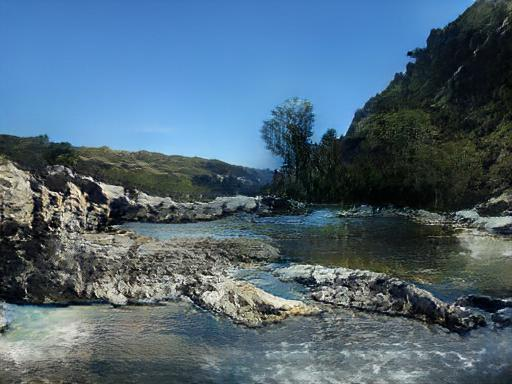

# Jittor 风景图片生成比赛




## 简介

本项目包含了第二届计图挑战赛计图 - 风景图像生成比赛的代码实现。本项目基于 SPADE (GauGAN) 实现，主体框架为 VAE-GAN，主要分成 Encoder, Generator, Discriminator 三个部分，训练阶段提供真实图片用于 Encoder 编码，推理阶段采用随机高斯分布采样直接将隐向量输入 Generator。

## 安装 

本项目可在 单张 RTX 3090 上运行，训练时间约为 50 小时。

#### 运行环境

- ubuntu 20.04 LTS
- python >= 3.7
- jittor >= 1.3.0

#### 安装依赖

执行以下命令安装 python 依赖

```
pip install -r requirements.txt
```

#### 预训练模型
1. vgg19
- 来源：jittor 库的骨干网络，预训练模型（代码中自动实现下载）
- 作用：models.networks.architecture 的 VGG19()，用于计算 perceptual loss

2. 请下载预训练模型并放置到 checkpoints/ 下，链接地址：

[下载地址](https://cloud.tsinghua.edu.cn/f/8563ad25ad3e49ada813/)

## 训练

单卡训练可运行以下命令：

```
python train.py --input_path <train_data_path>
```

请调整文件夹格式为

```
- <train_data_path>
|--- imgs/
    |--- .....
|--- labels/
    |--- .....
```
务必保证训练集的 imgs 和 labels 里的文件名一一对应。

## 推理

生成测试集上的结果可以运行以下命令：

```
python test.py --input_path <infer_data_path> --output_path ./results
```

## 致谢

Park T, Liu M Y, Wang T C, et al. Semantic image synthesis with spatially-adaptive normalization[C]//Proceedings of the IEEE/CVF conference on computer vision and pattern recognition. 2019: 2337-2346.

Karras T, Laine S, Aila T. A style-based generator architecture for generative adversarial networks[C]//Proceedings of the IEEE/CVF conference on computer vision and pattern recognition. 2019: 4401-4410.

Wang T C, Liu M Y, Zhu J Y, et al. High-resolution image synthesis and semantic manipulation with conditional gans[C]//Proceedings of the IEEE conference on computer vision and pattern recognition. 2018: 8798-8807.
